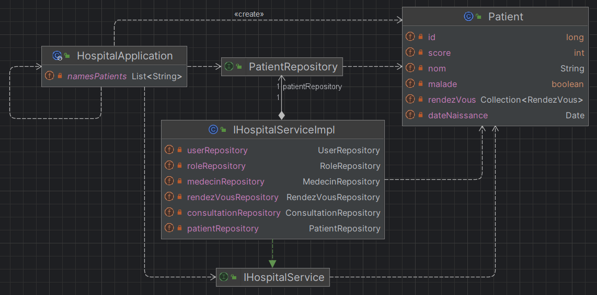
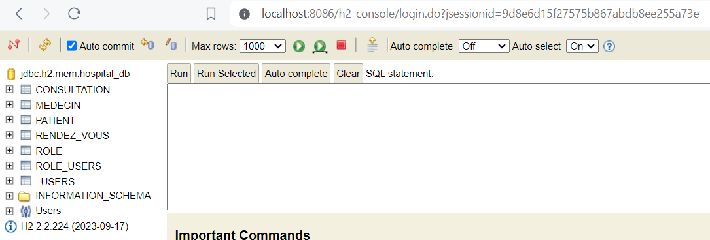
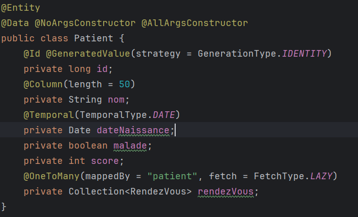
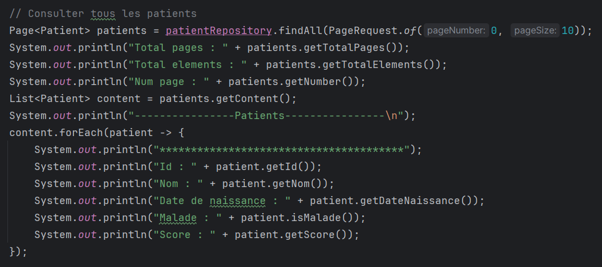
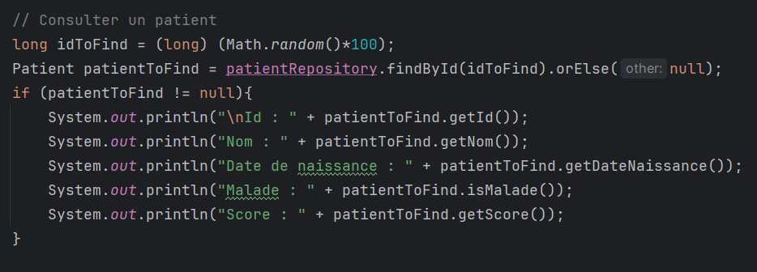
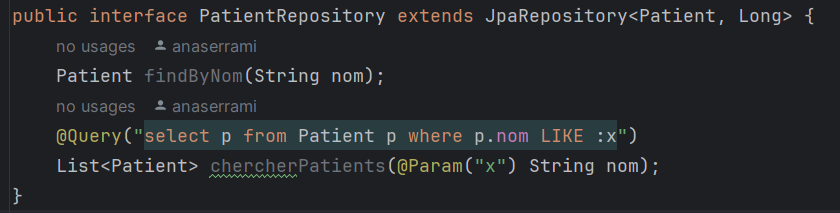
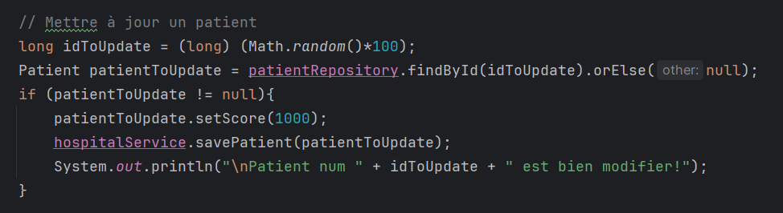
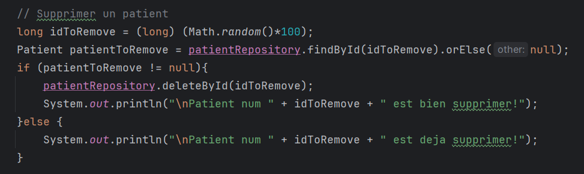

# Rapport - Application de Gestion Hospitalière en utilisant ORM, Jpa, Hibernate Spring Data

## Description
Ce projet est une application de gestion hospitalière réalisée avec Spring Boot, Hibernate et une base de données H2 or MySQL. L'application permet de gérer les patients, les médecins, les rendez-vous, les consultations, les utilisateurs et les rôles.

Pour le cas des patients :

* **La classe Patient** représente les informations d'un patient, comme son nom, sa date de naissance, s'il est malade, son score, etc.
* **PatientRepository** fournit des méthodes pour gérer les patients en base de données, comme les ajouter, les supprimer ou les rechercher.
* **IHospitalService** définit des méthodes pour gérer les patients, les médecins, etc., et IHospitalServiceImpl les implémente concrètement.
* **PatientRestController** expose des endpoints REST pour interagir avec les patients, comme récupérer la liste des patients.
* **HospitalApplication** est la classe principale qui lance l'application et initialise des données de test pour simuler son fonctionnement.

## Fonctionnalités

### Gestion des Patients
On a Patient.java : Cette classe définit un patient avec un id, un nom, une date de naissance, l'état de maladie, un score, et une liste de rendez-vous.

Ajouter des patient: Permet d'ajouter des nouveaux patients avec leurs noms, leurs dates de naissance, leurs états de santé (malade ou non), et leurs scores associés.

Consulter tous les patients: Permet de récupérer la liste complète de tous les patients enregistrés dans la base de données.

Consulter un patient: Permet de récupérer les informations détaillées d'un patient spécifique en utilisant son identifiant unique.

Rechercher des patients: Permet de rechercher des patients en fonction de leur nom.

Mettre à jour un patient: Permet de mettre à jour les informations d'un patient existant, telles que son nom, sa date de naissance, son état de santé et son score.

Supprimer un patient: Permet de supprimer un patient de la base de données en utilisant son identifiant unique.

Ces fonctionnalités offrent un moyen complet de gérer les patients dans un système hospitalier, en permettant d'ajouter, de consulter, de mettre à jour et de supprimer des patients enregistrés, ainsi que de rechercher des patients spécifiques en fonction de leur nom.

Et c'est la même chose pour les autres gestions de (medecins, rendez-vous, consultations, users, and roles).
